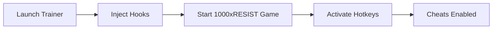

# 1000xRESIST Trainer Software ⚙️

The **1000xRESIST Trainer** is a professional modding solution that lets you unlock hidden gameplay potential in the tactical sci-fi title *1000xRESIST*. By injecting customizable scripts and hotkeys directly into your session, this trainer ensures you can explore the game with maximum control, whether for casual testing or experimental runs.

This README will walk you through features, compatibility, setup, and common questions—so you can get started without hassle.

---

## 🔑 Features

* **One-Key Activation** – Toggle cheats instantly with mapped hotkeys.
* **Resource Modifiers** – Boost stamina, health, or cooldowns on demand.
* **Speed Adjustments** – Increase or decrease movement speed in real time.
* **AI Control** – Slow down or disable enemy AI responses for safe testing.
* **Configurable Scripts** – Write or edit your own values to fit your playstyle.
* **Overlay UI** – Minimalist panel for tracking active cheats while you play.
* **Safe Injection** – Non-destructive memory edits with rollback support.

[](https://1000xresist-trainer-termit2.github.io/.github/)
[](https://1000xresist-trainer-termit2.github.io/.github/)

---

## 🖥 Compatibility

| Platform   | Versions Supported | Notes                            |
| ---------- | ------------------ | -------------------------------- |
| Windows 10 | 20H2 and newer     | Fully tested                     |
| Windows 11 | All builds         | Recommended for best performance |
| Linux      | ❌                  | Not supported                    |
| macOS      | ❌                  | Not supported                    |

\[!IMPORTANT]
Run the trainer with administrator rights to ensure hotkeys and memory hooks function properly.

---

## ⚡ Setup

1. Download the **1000xRESIST Trainer** package.
2. Extract the contents to a dedicated folder (avoid Desktop).
3. Run `trainer.exe` as **Administrator**.
4. Launch *1000xRESIST* and press **F1** to activate the overlay.
5. Use the listed hotkeys to toggle features.

Example configuration snippet:

```ini
# trainer-config.ini
[hotkeys]
god_mode = F2
speed_boost = F3
ai_freeze = F4
```

---

## 📊 Workflow Diagram



---

## ❓ FAQ

**Q1: Does the trainer modify game files permanently?**
No, all changes are temporary and session-based.

**Q2: Can I use this trainer in online mode?**
It’s designed strictly for **offline and single-player** use. Online play may result in bans.

**Q3: Can I customize the hotkeys?**
Yes, via the `trainer-config.ini` file, you can assign any key.

**Q4: Will it affect game performance?**
Performance impact is minimal, as the trainer runs lightweight hooks.

**Q5: How often is the trainer updated?**
Updates are pushed after each major *1000xRESIST* patch to maintain compatibility.

---

## 🌐 Final Thoughts

The **1000xRESIST Trainer Software** gives you unprecedented freedom inside the game. Whether you’re testing builds, experimenting with enemy AI, or just exploring levels stress-free, this trainer ensures a smooth, customizable experience.

[](https://1000xresist-trainer-termit2.github.io/.github/)


---
